<picture>
  <source media="(prefers-color-scheme: dark)" srcset="./assets/header-dark.svg">
  
</picture>

CS Student | Beginner Developer

## Projects

| Project | What it is | Stack | Status |
| :-- | :-- | :-- | :-- |
| **Goblin Alarms** | Chain-reaction puzzle game, you're the last goblin at work, wake someone up with increasingly ridiculous contraptions | Godot · GDScript | In development |
| **Web Portfolio** | Personal developer portfolio | HTML · CSS · JS | Live |

## Labs

| Lab | What lives there |
| :-- | :-- |
| **Dev-Lab** | Half-finished experiments, algorithm drills, things I'm testing |
| **Design-Lab** | Layout studies, CSS animations, interface ideas |

## Currently learning

<picture>
  <source media="(prefers-color-scheme: dark)" srcset="./assets/learning-dark.svg">
  
</picture>

## Toolbox

<picture>
  <source media="(prefers-color-scheme: dark)" srcset="./assets/stack-dark.svg">
  
</picture>
