## 🧠 Currently exploring

- **Computer science:** C, data structures, algorithms
- **Web development:** HTML, CSS, JavaScript
- **Game development:** Godot, GDScript

## 🛠️ Toolbox

## 🎮 Projects

| Project | What it is | Stack | Status |
| :-- | :-- | :-- | :-- |
| 🎮 **[Goblin Alarms](ADD_LINK)** | Chain-reaction puzzle game: you're the last goblin at work, waking someone up with increasingly ridiculous contraptions | Godot · GDScript |  |
| 🌐 **[Web Portfolio](ADD_LINK)** | Personal developer portfolio | HTML · CSS · JS |  |

## 🧪 Side Quests

| Lab | What lives there |
| :-- | :-- |
| 🧪 **[Dev-Lab](ADD_LINK)** | Half-finished experiments, algorithm drills, things I'm testing |
| 🎨 **[Design-Lab](ADD_LINK)** | Layout studies, CSS animations, interface ideas |

